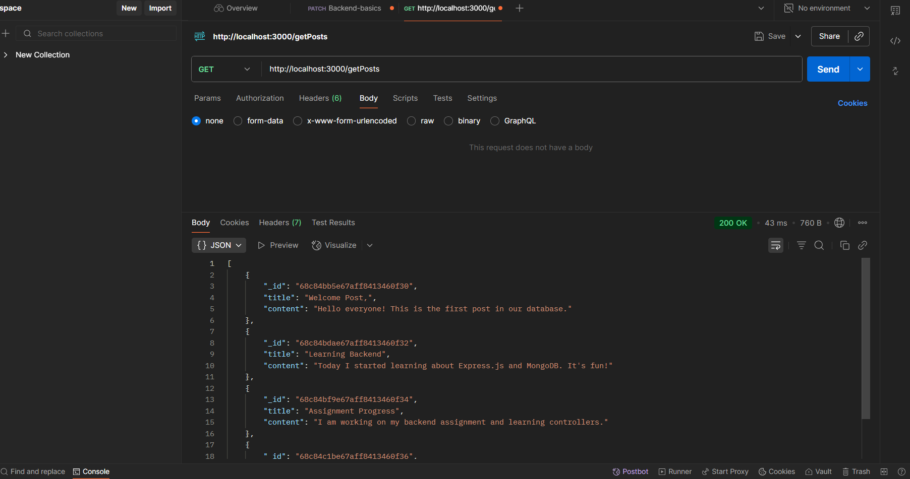
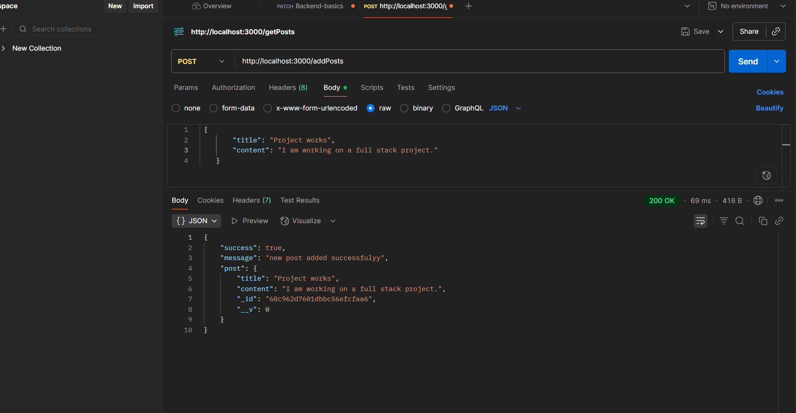
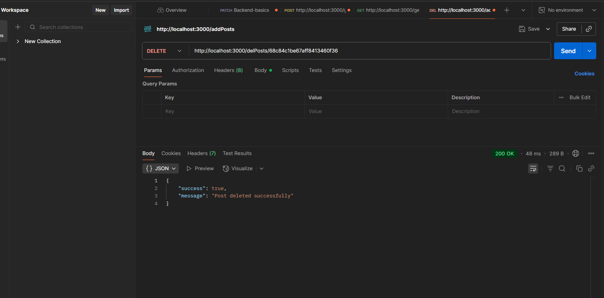
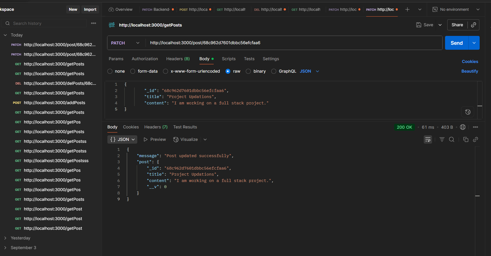

# Database Task: Full Stack Development

This project is a REST API built with Node.js, Express.js, and Mongoose for a full-stack development assignment. The API allows for basic CRUD (Create, Read, Update, Delete) operations on a database of "posts."

## Technologies Used

- **Node.js**: JavaScript runtime environment
- **Express.js**: Web application framework for Node.js
- **Mongoose**: MongoDB object modeling tool

## Functionality

The API exposes the following endpoints:

- `GET /getPosts`: Retrieves all posts from the database.
- `POST /addPosts`: Adds a new post to the database.
- `PATCH /post/:id`: Updates an existing post identified by its ID.
- `DELETE /delPosts/:id`: Deletes a post identified by its ID.

## Setup Instructions

1.  **Clone the repository:**
    ```bash
    git clone <your-repository-url>
    ```
2.  **Install dependencies:**
    ```bash
    npm install
    ```
3.  **Create a `.env` file** with your MongoDB connection string:
    ```
    MONGO_URI=your_mongodb_connection_string
    ```
4.  **Run the application:**
    ```bash
    npm start
    ```

## Screenshots

- **Endpoint: `GET /getPosts`**
  
  [database screenshot](screenshots/database-getPosts.png)

- **Endpoint: `POST /addPosts`**
  
  [database screenshot](screenshots/database-addPosts.png)

- **Endpoint: `DELETE /delPosts/:id`**
  
  [database screenshot](screenshots/database-delPosts.png)
  
- **Endpoint: `PATCH /post/:id`**
  
  [database screenshot](screenshots/database-updatePosts.png)


---

**Note**: The screenshots demonstrate the API's functionality and the corresponding changes in the MongoDB database.
